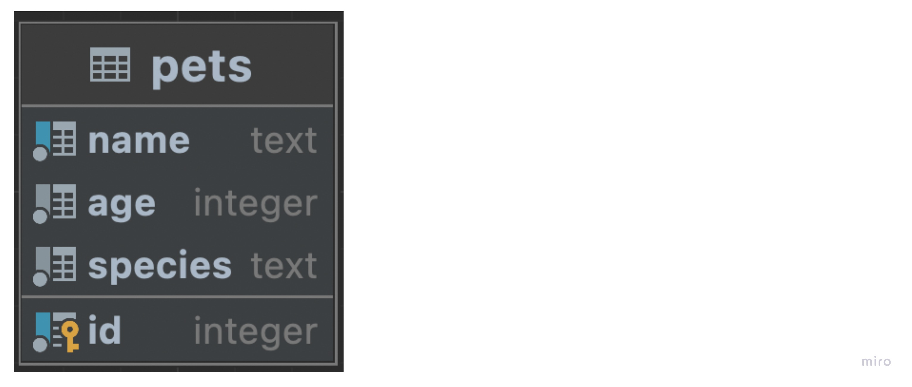

# Pet Clinic with Spring Boot and Jersey

## About 

This is an example **Java** RESTful web service for a **pet clinic**.
It is mainly based on [Spring Boot with Jersey](https://docs.spring.io/spring-boot/docs/2.6.7/reference/htmlsingle/#boot-features-jersey)
and [PostgreSQL](https://www.postgresql.org).

The whole list of tools used is as follows:
* [Spring Boot with Jersey](https://docs.spring.io/spring-boot/docs/2.6.7/reference/htmlsingle/#boot-features-jersey)
* [Jersey](https://eclipse-ee4j.github.io/jersey/)
* [Docker](https://www.docker.com)
* [PostgreSQL](https://www.postgresql.org)
* [Lombok](https://projectlombok.org)
* [Swagger](https://swagger.io)
* [Maven](https://maven.apache.org)

For testing:
* [JUnit](https://junit.org/junit5/)
* [Mockito](https://site.mockito.org/)
* [AssertJ](https://assertj.github.io/doc/)
* [Testcontainers](https://www.testcontainers.org)

## Installation

### Build project

Run `mvn package` to build project with _Maven_.

### Start application

Run `docker-compose --profile local up` to start application with _Docker_.

To check that your application is running enter url `http://localhost:8080/`

## Database Design

## Endpoints

`GET /pets` Get all pets

`PUT /pets` Create pet

`GET /pets/{pet_id}` Get pet

`POST /pets/{pet_id}` Update pet
